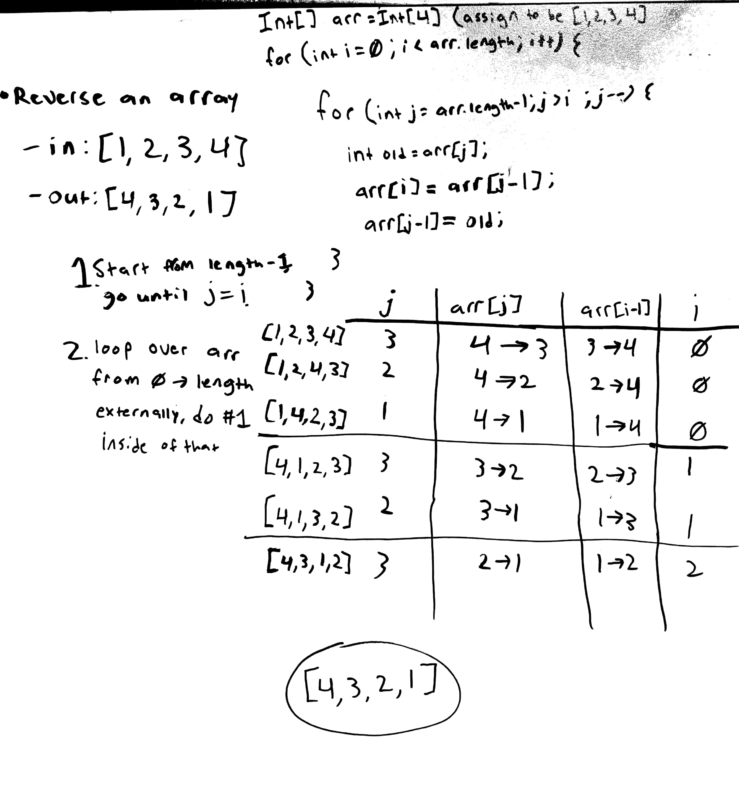

# data-structures-and-algorithms
This repo contains various code challenges from Code Fellows 301 JavaScript course as well as data structures and algorithms challenges from the Code Fellows 401 Java class.

# 301 JavaScript
all 301 JavaScript code challenges are within the code challenges/301 [folder](code-challenges/301)

# 401 Java Table of Contents
This table is organized by which day of class each challenge was assigned
1. [Array Reverse](401/src/main/java/ArrayReverse.java) - [Challenge Documentation](#array-reverse)
2. [Array Shift](401/src/main/java/ArrayShift.java) - [Challenge Documentation](#array-shift)
3. [Array Binary Search](401/src/main/java/BinarySearch.java) - [Challenge Documentation](#array-binary-search)
4. [Singly Linked List](401/src/main/java/linkedlists) - [Challenge Documentation](#singly-linked-list)
5. [Linked List Insertions](401/src/main/java/linkedlists) - [Challenge Documentation](#linked-list-insertions)
6. [Linked List Find K From End](401/src/main/java/linkedlists) - [Challenge Documentation](#linked-list-find-k-from-end)
7. [Merge Two Linked Lists](401/src/main/java/linkedlists) - [Challenge Documentation](#merge-two-linked-lists)
8. [Stacks and Queues](401/src/main/java/stacksandqueues) - [Challenge Documentation](#stacks-and-queues)

# 401 Challenge Documentation

## Array Reverse

### Challenge
Write a function that takes an array as an argument and returns an array that is the reverse of the original.

### Approach and Efficiency
The approach used for this challenge was using nested for loops to start from the end of the array and move one item to it's reveresed position each iteration. I'm not sure how to calculate efficiency based on Big O yet.

### Solution

## Array Shift

### Challenge
Write a function that takes an array and a value as arguments. It should return an array with the new value at the middle index

### Approach and Efficiency
The approach for this challenge was to take all the values in the original array before it's middle and add them to a new array that had a length 1 greater than the original, then insert the new value at the middle index, followed by taking the rest of the values in the original array and adding them to the new array at an index 1 higher than they were in the original. This approach could probably be more efficient, however with only limited knowledge of arrays in Java, this was the only workable idea I wound up with.

### Solution

## Array Binary Search

### Challenge
Write a function that takes a sorted array and a value as arguments. Utilize a binary search to find the given value and return the index where it is located, or return -1 if it is not in the array.

### Approach and Efficiency
The approach for this challenge was to use a set of conditional checks to determine if the new "middle" index needs to be moved to the left or right or the current location, however the whiteboarded solution missed on handling certain issues. The biggest issues were ensuring that the while loop does eventually exit in the case of not finding the given value, and not adjusting what our right bound is in the instance where we move to the left but then need to move off to the right after. The efficiency of the final solution is O(log n) time at worst, and O(1) space.

### Solution

## Singly Linked List
A LinkedList class and Node class. The LinkedList keeps track of what node is its head value, and each node contains its own value and a pointer to the node after it in the list.

### Challenge
* Create a Node class that has properties for the value stored in the Node, and a pointer to the next Node.
* Within your LinkedList class, include a head property. Upon instantiation, an empty Linked List should be created.
  * This object should be aware of a default empty value assigned to head when the linked list is instantiated.
  * Define a method called insert which takes any value as an argument and adds a new node with that value to the head of the list with an O(1) Time performance.
  * Define a method called includes which takes any value as an argument and returns a boolean result depending on whether that value exists as a Node’s value somewhere within the list.
  * Define a method called print which takes in no arguments and outputs all of the current Node values in the Linked List.

### Approach & Efficiency
The approach for the insert method was to reassign the head property to a new Node that is constructed with the passed in value. This makes it a 0(1) time and space function. The includes and print methods both iterate over Nodes while not looking at a null node (the last node in the list). Both of these functions are O(n) time and O(1) space.

### API

#### Insert
takes in an integer value to assign to a new node and inserts it at the head of the linked list

#### Includes
Searches the linked list to see if any node contains the provided value and will return true if so, otherwise returns false.

#### Print
Will print out the list as a comma separated list contained between \< and \> 

## Linked List Insertions

### Challenge
* Add an append challenge to your LinkedList class that takes a value and adds it at the end of the Linked List.
* Add an insertBefore function to your LinkedList class that takes in a value and newValue, and inserts a new Node before the Node that contains the given value.
* Add an insertAfter function to your LinkedList class that takes in a value and newValue, and inserts a new Node after the Node that contains the given value.

### Approach and Efficiency
The approach for all these methods involves iterating over the Nodes in the Linked List until reaching the given position where the new Node needs to be inserted. The new Node is then created and inserted into the list by updating other Nodes next value where necessary. All three of these functions take O(n) time and O(1) space.

### Solution

## Linked List Find K From End

### Challenge
Write a method for your LinkedList class that takes in an integer k and returns the value from the kth node from the end of the list.

### Approach and Efficiency
The approach for this method was to start by looking at the head of the list, and then look k nodes forward from there and see if the next value of that node is null. If that node k away from the current has a next value of null then it will return the value from the current node. If not, then the current node will be set to the next in the list until either the proper node is found or the function has to throw an error due to being out of the bounds of the list. The time of this method is O(n) and the space is O(1).

### Solution

## Merge Two Linked Lists

### Challenge
Write a static method for your LinkedList class that takes in two LinkedLists and merges them together, alternating nodes from each list, and returns the head of the new list

### Approach and Efficiency
The approach for this method was to merge the second list into the first one, simply adding values after each node from the original list. To achieve this a counter is used while moving through both the lists, and every time the counter is an even number a node from the 2nd List is inserted into the first. It will also handle cases where one of the two lists are longer than the other, and if one or both lists are empty (head points to null). The Big O time efficiency for this solution is O(n) and the space efficiency is O(1).

### Solution

## Stacks and Queues
Contains a Stack, Queue, and Node class. The Stack operates on a last in first out (LIFO) basis, and the Queue operates on a first in first out (FIFO) basis. A Stack object contains a reference to its top Node, a Queue object contains references for the front and rear Nodes. Each Node contains a value and a reference to the next Node in the Stack/Queue.

### Challenge
* Create a Node class that has properties for the value stored in the Node, and a pointer to the next Node.
* Create a Stack class that has a top property. It creates an empty Stack when instantiated.
  * This object should be aware of a default empty value assigned to top when the stack is created.
  * Define a method called push which takes any value as an argument and adds a new node with that value to the top of the stack with an O(1) Time performance.
  * Define a method called pop that does not take any argument, removes the node from the top of the stack, and returns the node.
  * Define a method called peek that does not take an argument and returns the node located on the top of the stack.
* Create a Queue class that has a top property. It creates an empty queue when instantiated.
  * This object should be aware of a default empty value assigned to front when the queue is created.
  * Define a method called enqueue which takes any value as an argument and adds a new node with that value to the back of the queue with an O(1) Time performance.
  * Define a method called dequeue that does not take any argument, removes the node from the front of the queue, and returns the node.
  * Define a method called peek that does not take an argument and returns the node located in the front of the stack.

### Approach & Efficiency
The approach for the push method is to point the top reference to a new Node containing the provided value and it's next being the old top of the stack. The pop method temporarily stores the top node, sets the top to be the old tops next, and returns the old tops value. The enqueue method adds a new Node as the next of the old rear, then sets the rear to point at the new Node. Dequeue works in the same way as the pop method, but uses the front of the queue, as opposed to the top.

### API

#### Stack
---
##### Push
Takes in a value and adds a new Node with the provided value to the top of the stack with a O(1) time efficiency.

##### Pop
Removes the top Node from the stack and returns its value.

##### Peek
Returns the current top Node of the stack.

#### Queue
---
##### Enqueue
Takes in a value and adds a new Node to the rear of the queue with a O(1) time efficiency.

##### Dequeue
Removes the front Node from the queue and returns its value.

##### Peek
Returns the current front Node of the queue.
