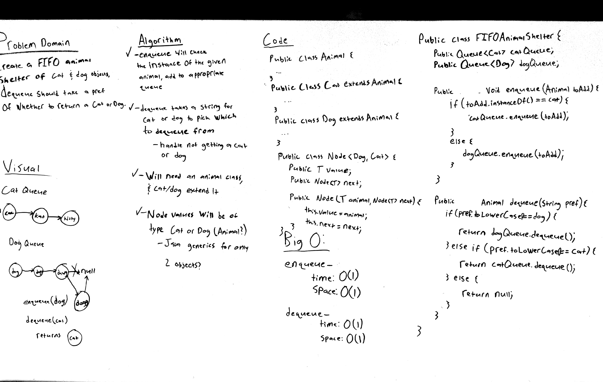
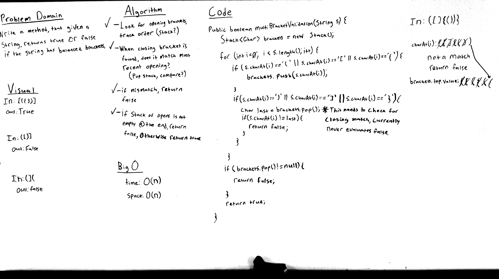

# data-structures-and-algorithms
This repo contains various code challenges from Code Fellows 301 JavaScript course as well as data structures and algorithms challenges from the Code Fellows 401 Java class.

# 301 JavaScript
all 301 JavaScript code challenges are within the code challenges/301 [folder](code-challenges/301)

# 401 Java Table of Contents
This table is organized by which day of class each challenge was assigned
1. [Array Reverse](401/src/main/java/ArrayReverse.java) - [Challenge Documentation](#array-reverse)
2. [Array Shift](401/src/main/java/ArrayShift.java) - [Challenge Documentation](#array-shift)
3. [Array Binary Search](401/src/main/java/BinarySearch.java) - [Challenge Documentation](#array-binary-search)
4. [Singly Linked List](401/src/main/java/linkedlists) - [Challenge Documentation](#singly-linked-list)
5. [Linked List Insertions](401/src/main/java/linkedlists) - [Challenge Documentation](#linked-list-insertions)
6. [Linked List Find K From End](401/src/main/java/linkedlists) - [Challenge Documentation](#linked-list-find-k-from-end)
7. [Merge Two Linked Lists](401/src/main/java/linkedlists) - [Challenge Documentation](#merge-two-linked-lists)
8. [Stacks and Queues](401/src/main/java/stacksandqueues) - [Challenge Documentation](#stacks-and-queues)
9. [Queue with Stacks](401/src/main/java/QueueWithStacks) - [Challenge Documentation](#queue_with_stacks)
10. [First-in, First-out Animal Shelter](401/src/main/java/FIFOAnimalShelter) - [Challenge Documentation](#first-in-first-out-animal-shelter)
11. [Multi-Bracket Validation](401/src/main/java/multibracketvalidation) - [Challenge Documentation](#multi-bracket-validation)
12. [Trees](401/src/main/java/tree) - [Challenge Documentation](#trees)
13. [FizzBuzz Tree](401/src/main/java/fizzbuzztree) - [Challenge Documentation](#fizzbuzz-tree)
14. [Breadth First Traversal](401/src/main/java/tree/BinaryTree.java) - [Challenge Documentation](#breadth-first-traversal)
15. [Find Maximum Value Binary Tree](401/src/main/java/tree/BinaryTree.java) - [Challenge Documentation](#find-maximum-value-binary-tree)
16. [Graph](401/src/main/java/graph) - [Challenge Documentation](#graph)
17. [Breadth First Graph](401/src/main/java/graph/Graph.java) - [Challenge Documentation](#breadth-first-graph)
18. [Get Edges](401/src/main/java/getedge/GetEdge.java) - [Challenge Documentation](#get-edges)
19. [Depth First](401/src/main/java/depthfirst/DepthFirst.java) - [Challenge Documentation](#depth-first)
20. [Hashtable](401/src/main/java/hashtable) - [Challenge Documentation](#hashtable)
21. [Repeated Word](401/src/main/java/repeatedword) - [Challenge Documentation](#repeated_word)

# 401 Challenge Documentation

## Array Reverse

### Challenge
Write a function that takes an array as an argument and returns an array that is the reverse of the original.

### Approach and Efficiency
The approach used for this challenge was using nested for loops to start from the end of the array and move one item to it's reveresed position each iteration. I'm not sure how to calculate efficiency based on Big O yet.

### Solution

## Array Shift

### Challenge
Write a function that takes an array and a value as arguments. It should return an array with the new value at the middle index

### Approach and Efficiency
The approach for this challenge was to take all the values in the original array before it's middle and add them to a new array that had a length 1 greater than the original, then insert the new value at the middle index, followed by taking the rest of the values in the original array and adding them to the new array at an index 1 higher than they were in the original. This approach could probably be more efficient, however with only limited knowledge of arrays in Java, this was the only workable idea I wound up with.

### Solution

## Array Binary Search

### Challenge
Write a function that takes a sorted array and a value as arguments. Utilize a binary search to find the given value and return the index where it is located, or return -1 if it is not in the array.

### Approach and Efficiency
The approach for this challenge was to use a set of conditional checks to determine if the new "middle" index needs to be moved to the left or right or the current location, however the whiteboarded solution missed on handling certain issues. The biggest issues were ensuring that the while loop does eventually exit in the case of not finding the given value, and not adjusting what our right bound is in the instance where we move to the left but then need to move off to the right after. The efficiency of the final solution is O(log n) time at worst, and O(1) space.

### Solution

## Singly Linked List
A LinkedList class and Node class. The LinkedList keeps track of what node is its head value, and each node contains its own value and a pointer to the node after it in the list.

### Challenge
* Create a Node class that has properties for the value stored in the Node, and a pointer to the next Node.
* Within your LinkedList class, include a head property. Upon instantiation, an empty Linked List should be created.
  * This object should be aware of a default empty value assigned to head when the linked list is instantiated.
  * Define a method called insert which takes any value as an argument and adds a new node with that value to the head of the list with an O(1) Time performance.
  * Define a method called includes which takes any value as an argument and returns a boolean result depending on whether that value exists as a Node’s value somewhere within the list.
  * Define a method called print which takes in no arguments and outputs all of the current Node values in the Linked List.

### Approach & Efficiency
The approach for the insert method was to reassign the head property to a new Node that is constructed with the passed in value. This makes it a 0(1) time and space function. The includes and print methods both iterate over Nodes while not looking at a null node (the last node in the list). Both of these functions are O(n) time and O(1) space.

### API

#### Insert
takes in an integer value to assign to a new node and inserts it at the head of the linked list

#### Includes
Searches the linked list to see if any node contains the provided value and will return true if so, otherwise returns false.

#### Print
Will print out the list as a comma separated list contained between \< and \> 

## Linked List Insertions

### Challenge
* Add an append challenge to your LinkedList class that takes a value and adds it at the end of the Linked List.
* Add an insertBefore function to your LinkedList class that takes in a value and newValue, and inserts a new Node before the Node that contains the given value.
* Add an insertAfter function to your LinkedList class that takes in a value and newValue, and inserts a new Node after the Node that contains the given value.

### Approach and Efficiency
The approach for all these methods involves iterating over the Nodes in the Linked List until reaching the given position where the new Node needs to be inserted. The new Node is then created and inserted into the list by updating other Nodes next value where necessary. All three of these functions take O(n) time and O(1) space.

### Solution

## Linked List Find K From End

### Challenge
Write a method for your LinkedList class that takes in an integer k and returns the value from the kth node from the end of the list.

### Approach and Efficiency
The approach for this method was to start by looking at the head of the list, and then look k nodes forward from there and see if the next value of that node is null. If that node k away from the current has a next value of null then it will return the value from the current node. If not, then the current node will be set to the next in the list until either the proper node is found or the function has to throw an error due to being out of the bounds of the list. The time of this method is O(n) and the space is O(1).

### Solution

## Merge Two Linked Lists

### Challenge
Write a static method for your LinkedList class that takes in two LinkedLists and merges them together, alternating nodes from each list, and returns the head of the new list

### Approach and Efficiency
The approach for this method was to merge the second list into the first one, simply adding values after each node from the original list. To achieve this a counter is used while moving through both the lists, and every time the counter is an even number a node from the 2nd List is inserted into the first. It will also handle cases where one of the two lists are longer than the other, and if one or both lists are empty (head points to null). The Big O time efficiency for this solution is O(n) and the space efficiency is O(1).

### Solution

## Stacks and Queues
Contains a Stack, Queue, and Node class. The Stack operates on a last in first out (LIFO) basis, and the Queue operates on a first in first out (FIFO) basis. A Stack object contains a reference to its top Node, a Queue object contains references for the front and rear Nodes. Each Node contains a value and a reference to the next Node in the Stack/Queue.

### Challenge
* Create a Node class that has properties for the value stored in the Node, and a pointer to the next Node.
* Create a Stack class that has a top property. It creates an empty Stack when instantiated.
  * This object should be aware of a default empty value assigned to top when the stack is created.
  * Define a method called push which takes any value as an argument and adds a new node with that value to the top of the stack with an O(1) Time performance.
  * Define a method called pop that does not take any argument, removes the node from the top of the stack, and returns the node.
  * Define a method called peek that does not take an argument and returns the node located on the top of the stack.
* Create a Queue class that has a top property. It creates an empty queue when instantiated.
  * This object should be aware of a default empty value assigned to front when the queue is created.
  * Define a method called enqueue which takes any value as an argument and adds a new node with that value to the back of the queue with an O(1) Time performance.
  * Define a method called dequeue that does not take any argument, removes the node from the front of the queue, and returns the node.
  * Define a method called peek that does not take an argument and returns the node located in the front of the stack.

### Approach & Efficiency
The approach for the push method is to point the top reference to a new Node containing the provided value and it's next being the old top of the stack. The pop method temporarily stores the top node, sets the top to be the old tops next, and returns the old tops value. The enqueue method adds a new Node as the next of the old rear, then sets the rear to point at the new Node. Dequeue works in the same way as the pop method, but uses the front of the queue, as opposed to the top.

### API

#### Stack
---
##### Push
Takes in a value and adds a new Node with the provided value to the top of the stack with a O(1) time efficiency.

##### Pop
Removes the top Node from the stack and returns its value.

##### Peek
Returns the current top Node of the stack.

#### Queue
---
##### Enqueue
Takes in a value and adds a new Node to the rear of the queue with a O(1) time efficiency.

##### Dequeue
Removes the front Node from the queue and returns its value.

##### Peek
Returns the current front Node of the queue.

## Queue With Stacks

### Challenge
Implement a Pseudo Queue class that acts just like a Queue but operates internally using two stacks. It should include an enqueue and dequeue method that work under the first in first out basis.

### Approach and Efficiency
The approach for this challenge was to maintain the queues state in one primary stack, which is achieved by popping the primary stack and pushing each value into the secondary stack when a new item needs to be added. When the primary stack is empty, the enqueued value is added to it, then the process of popping and pushing is reversed, moving all the other values back from the secondary stack to the primary. This will move the enqueued value to the bottom of the stack, and maintain the proper order for the queue, with the first item in being on the top. The Big O efficiency for this method is O(n) time and space.

The usefulness of maintaining the state of the queue all with the enqueue method means that the dequeue method simply just has to pop the top value from the primary stack and return in, giving it O(1) time and space efficiency.

### Solution

## First-in, First-out Animal Shelter

### Challenge
Create a class called AnimalShelter which holds only dogs and cats. The shelter operates using a first-in, first-out approach. The shelter should have an enqueue(animal) method that will add either a cat or dog object to the shelter. The shelter should also have a dequeue(pref) method that takes a preference of either cat or dog and returns either a cat or dog based on that preference.

### Approach and Efficiency
The approach for this challenge was to utilize two queues within the AnimalShelter class, one queue of dogs and one queue of cats. Enqueue checks to see what type of animal is being enqueued and will then call the enqueue method for the appropriate animal queue. The dequeue works in a similar way, checking the preference string entered and then dequeueing an animal from the appropriate queue and returning that animal. This allows for a time and space efficiency of O(1) for these methods, as they are utilizing the already O(1) methods on the internal queues.

### Solution

## Multi-Bracket Validation

### Challenge
Write a method named multiBracketValidation that, given a string, returns true or false if that string has balanced brackets ie: (){[]} returns true but ({[)]} returns false.

### Approach and Efficiency
The approach for this challenge was to use a stack to track every instance of an opening bracket found, as they will then need to be closed in a last-in first-out order. Whenever a closing bracket is found, the top value from the stack of opening brackets is popped to see what type of closing bracket should be expected. If a closing bracket does not match to what it should be, or the stack is not empty after iterating through the entire string, the method will return false. This method has a Big O time and space efficiency of O(n) due to the need of creating a stack to track all opening brackets and having to iterate over every character in the string.

### Solution

## Trees
Contains a BinaryTree, BinarySearchTree, and Node class. Each node has properties for its value, left child, and right child. A BinaryTree is for just a collection of these nodes, while a BinarySearchTree will sort them to the left or right based on their value in comparison to the root.

### Challenge
* Create a Node class that has properties for the value stored in the Node, and a pointer to its left adn right children.
* Create a BinaryTree class that has a root property.
  * Define methods for preOrder, inOrder, and postOrder that take in a root node and returns an array of nodes.
* Create a BinarySearchTree class.
  * Define a method called add that takes in a value and adds a new node to the right place in the tree
  * Define a method called search that takes in a desired value and returns the node with that value

### Approach & Efficiency
The preOrder, inOrder, and postOrder methods all traverse the tree recursively, meaning they each take O(n) time. Since they all return an ArrayList of Nodes, they also take O(n) space. The add and search methods for the BinarySearchTree should both take O(log n) time and O(1) space.

### API

#### preOrder
Takes in a root node, and returns the all nodes in the tree as an ArrayList ordered by root, left, right.

#### inOrder
Takes in a root node, and returns the all nodes in the tree as an ArrayList ordered by left, root, right.

#### postOrder
Takes in a root node, and returns the all nodes in the tree as an ArrayList ordered by left, right, root.

#### add
Takes in a value and traverses the BinarySearchTree to add it in the correct place

#### search
Takes in a value and returns the node that contains that value, or null if no node contains that value.

## FizzBuzz Tree

### Challenge
Create a class named FizzBuzzTree that contains a method named fizzBuzzTree. This method should take in a tree, and change the values of the nodes based on their current value. If the value is divisible by 3, the node's value should be changed to fizz. If the value is divisible by 5, the node's value should be changed to buzz. If the value is divisible by both 3 and 5, the node's value should be changed to fizzbuzz.

### Approach and Efficiency
The approach for this method was to traverse the list in a post-order depth search, and check the nodes value to see which condition it meets (divisible by 3, divisible by 5, or both) and change its value as needed. This solution takes O(n) time as it has to traverse the entire tree recursively, and O(1) space.

### Solution

## Breadth First Traversal

### Challenge
Within the BinaryTree class, create a method that takes in a tree, and prints out the values of it Nodes via a breadth first traversal.

### Approach and Efficiency
The approach used for this challenge was to utilize a queue, starting by enqueueing the root node and then dequeuing it, printing its value and enqueuing its children. This process is repeated for every Node in the tree, which will fill the queue level by level for all the Nodes in the tree. This method is O(n) for both time and space. 

### Solution

## Find Maximum Value Binary Tree

### Challenge
Within the BinaryTree class, write a method that takes in a tree and returns the highest value stored in the tree. Assume that all the nodes contain integer values.

### Approach and Efficiency
The approach taken for this challenge was to traverse the tree using a depth first post-order recursive method. It will find what the highest value node is to both the right and left of a node, and then compare those values to find which is the highest, and return it. This method takes O(n) time since it needs to traverse the entire tree, and O(n) space as the more Nodes there are, the more variables are created as the call stack grows in size.

### Solution

## Graph
A LinkedList class and Node class. The LinkedList keeps track of what node is its head value, and each node contains its own value and a pointer to the node after it in the list.

### Challenge
Implement your own Graph. The graph should be represented as an adjacency list, and should include the following methods: 1. addNode() - Adds a new node to the graph - Takes in the value of that node - Returns the added node 2. addEdge() - Adds a new edge between two nodes in the graph - Include the ability to have a “weight” - Takes in the two nodes to be connected by the edge - Both nodes should already be in the Graph.
The Graph should also include: 
   * getNodes() - Returns all of the nodes in the graph as a collection (set, list, or similar)
   * getNeighbors() - 
     * Returns a collection of nodes connected to the given node
     * Takes in a given node
     * Include the weight of the connection in the returned collection
   * size() - Returns the total number of nodes in the graph

### Approach & Efficiency
The Graph class itself utilizes an ArrayList of Nodes to be able to easily access a Node and it's properties. Within each Node is its value and an ArrayList of its neighbors, stored as Edges. An Edge holds a pointer to the neighbor for the Node it belongs to, as well as a weight (if provided. Default is 0). With this implementation, each method within the graph class takes O(1) time and space as they utilize the methods on Lists.

### API

#### getNodes
Takes in no arguments, returns an ArrayList of all the Nodes within the Graph.

#### getNeighbors
Takes in a single Node as an argument, and returns an ArrayList of neighbors for that Node, where each value is an Edge that points to a neighbor.

#### size
Takes in no arguments and returns the total number of Nodes in the Graph

#### addNode
Takes in a value and creates a new Node with that value and adds it to the Graph. Returns the new Node.

#### addEdge
Takes in two unique Nodes that are in the Graph as arguments, and can optionally take in an integer value for a weight. It will add an Edge to each of the provided Nodes list of neighbors. If a weight is not specified, the weight will be set to 0 by default. Will throw an exception if the Nodes provided are not both in the graph or are the same Node.

## Breadth First Graph

### Challenge
Within the Graph class, add a method that takes in a root Node and performs a breadth first traversal from that Node and returns a list of all the Nodes visited.

### Approach and Efficiency
The approach taken for this method was to utilize a List of Nodes to be returned, a Set of Nodes that had already been seen while traversing, and a Queue to maintain the order of traversal. Starting from the root, it is added to the Queue and the Set of seen Nodes. The algorithm then loops while the Queue is not empty, dequeuing the front value, adding it to the List to return, and then iterating over its list of neighbors. Each neighbor Node is checked to see if it's in the Set of already seen Nodes, and if it is not, then that Node is added to the queue and the Set of seen Nodes. Once the Queue is empty, the List of Nodes is returned. This solution takes both O(n) space and time, as it has to iterate over each Nodes neighbors, and utilize multiple other data structures to track all relevant information.
### Solution

## Get Edges

### Challenge
Write a function which takes in a graph, and an array of city names. Without utilizing any of the built-in methods available to your language, return whether the full trip is possible with direct flights, and how much it would cost.

### Approach and Efficiency
The approach for this method was to first iterate over the graphs list of Nodes to find the node whose value matches the provided arrays value at index 0. This node is then the starting node, from where a set of nested for loops begins, starting at i = 1 and looking through the start nodes edges to find if any of its neighbors match the arrays value at index i. If a match is found, then the start node becomes that neighbor node, and the outer loop repeats. If at any point the method cannot find a direct connection to the next city, it will return 0, meaning the trip is not possible with direct flights. The Time efficiency for this method is O(n * d) where d represents the degree of the graph. This methods space efficiency is O(1), as it only ever needs an instance variable for one node and an integer for the cost.

### Solution

## Depth First

### Challenge
Write a method that takes in a graph and returns a collection of nodes in depth-first pre-order

### Approach and Efficiency
The approach for this method was to grab the first Node in the graphs list of nodes, and then utilize a stack to maintain the order in which to visit nodes. The first node of the graph is added to the stack and the list of seen nodes, and then a loop is performed while the stack is not empty. Within that loop, a node is popped off the stack, added to the list that will be returned, and then its list of neighbors is iterated over. Each neighbor node is checked if it is in the seen set, and if it isn't then it's added to the seen set and placed on the stack. Once the stack is empty, the method will return the pre-ordered list of nodes. This method takes O(n * d) time, where d represents the degree of the graph. It will require O(n) space as there are multiple data structures in place that will take more space in direct relation to the # of nodes in the graph.

### Solution

## Hashtable
A Hashtable class that allows for construction based on a user defined size. Creates an array of linked lists of that size. Uses a simple hash method to create has indexes when adding key/value pairs to the table.

### Challenge
Implement a Hashtable with the following capabilities
  * a method named add that takes in both the key and value. This method should hash the key and add the key and value pair to the table.
  * A method named Find that takes in the key and returns the value from key/value pair.
  * A method named contains that takes in the key and returns if the key exists in the table already.

### Approach & Efficiency
This Hashtable implementation uses an array of linked lists to hold values at each index. The index a value is stored at depends on the hash generated from the getHash method. The use of linked lists is to handle the case of collisions. Assuming that a list is large enough to avoid constant collisions, the add, find, and contains methods all take constant [O(1)] time and space to run. The table will take O(n) space, where n represents the number of key/value pairs added to the table

### API

#### add
Takes in a key and a value, hashes the key and adds the pair to the index for that hash

#### contains
Takes in a key and returns true if that key is already in the table, false if not

#### find
Takes in a key and returns that value associated with it in the table. Will throw a NoSuchElementException if the key is not in the table.

## Repeated Word

### Challenge
Write a method that takes in a String and returns the first repeated word in that String, without utilizing any of the built-in library methods available to your language,

### Approach and Efficiency
The approach for this was to iterate over every character in the String and look for when the current character was a space, comma, or period (could include more punctuation cases). After that, there is a check to handle not including punctuation when grabbing a word, and then the last word that occurred before that space, period, or comma is grabbed, and checked if it's in the HashSet. If it is, that word is immediately returned, as we want to return the first instance that condition is true. If it is not in the Set, then the word is added to the set and the loop continues. This solution takes O(n) time and space.

### Solution
